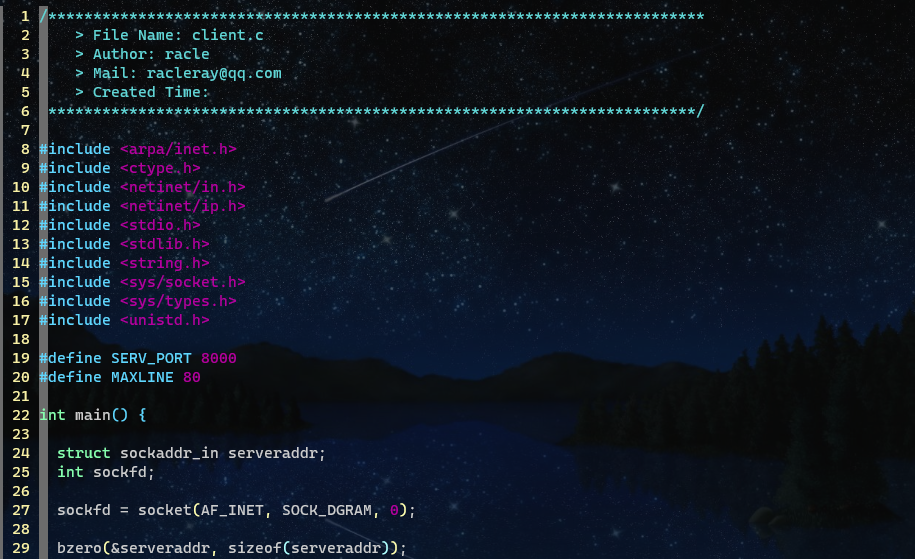
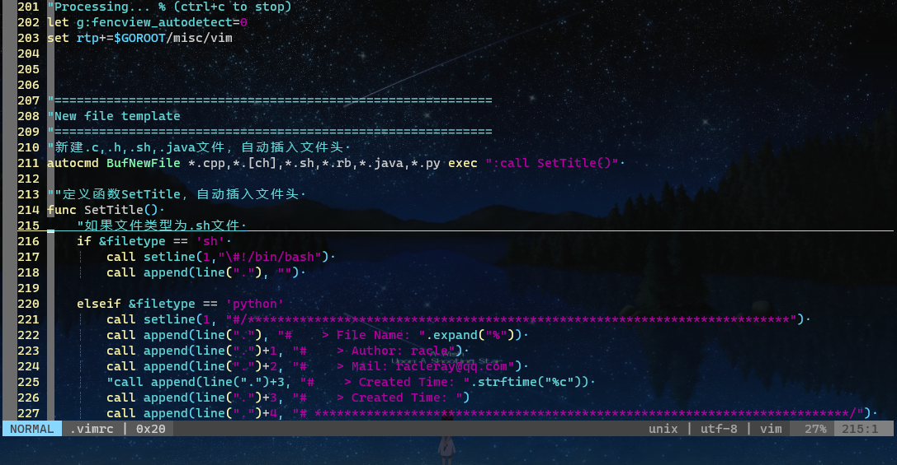
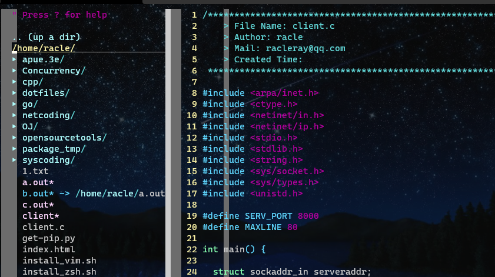
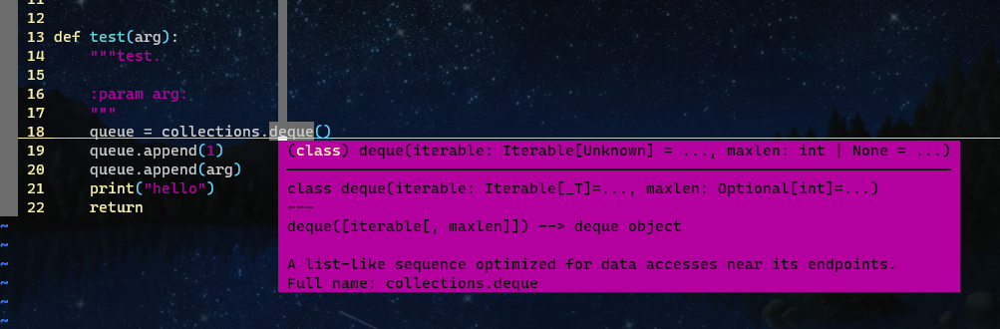

## Installation

requirement: pip python (3+) gcc g++

1. `bash install_zsh.sh` (Optional)
2. `bash zsh_pack_install.sh`  (Optional)
3. `bash install_vim.sh`

## Usage

.vimrc 配置快捷键，安装包。使用Vundle管理，Normal模式下，`:PluginInstall`，开始安装。本地集成了常用包，不需要从git再去下载。自定义的其他包需要自己解决。

- 需要 vim 8.2+，配置中会自动安装更新
- Unbuntu系统
- pip 可能需要自行安装，一般执行：`sudo apt install python3-pip`，就行了，gcc g++ 会自动安装。有自定义需要，自行安装其他编译器。

### 自动添加文件信息

### 文件树集成

快捷键 -- F3

### Coc 集成

语法实时检查，智能代码推荐，等等。扩展看[coc.nvim](https://github.com/neoclide/coc.nvim/wiki)文档。

### 其他扩展及多快捷键设置

其他扩展有状态栏美化、括号补全美化等。

详见 .vimrc 290 行 及 560 行配置。

- `sp` file 新建水平窗口
- `vs` file 新建垂直窗口
- `:tabnew` file 新建标签页，`shift`+ :arrow_left:前一个标签，`shift`+:arrow_right:后一个标签
- `ctrl w` 切换窗口
- `F2` 去空行
- `F5` 编译运行
- `F6` clang format, ~/.clang-format 配置格式
- `F8` C C++ gdb
- `F7` C ansi格式化，python autopep8
- `F12` python flake8检查
- Fuzzy finder，`ff` 模糊查询文件，其他功能 .vimrc 555 行
- ctrlp，`ctrl p` 模糊查询文件
- CtrlPFunky，`\fu` 或者 `ctrl n` 模糊查询代码中函数
- `Z` 标记当前行位置，`gb` 跳转到标记位置
- 普通模式下 `M` 键会新开前窗口打开光标对应位置代码的说明文档 (shift + m)

- `TAB` 键为下一个补全候选项；`Shift + TAB` 组合键为上一个补全候选项；`Ctrl + Enter `组合键为呼出候选菜单；  `Enter` 键确定。
- `\rn` 为 批量重命名 操作
- `\f` 格式化选中代码，先确定配置好了 language server 和 格式配置文件
- "  `gd `和 `gD `跳转到定义
  "  `gy `跳转到type definition
  "  `gi `跳转到实现
  "  `gr `跳转到引用
- `\cc` 快捷注释；`\cu` 取消注释。和使用 visual mode 比，就方便了一点。

其他Vim快捷键一起使用，会很像VSCode。

- `za` 代码折叠，展开
- `ctrl o` 上次停留位置跳转
- `:terminal` 呼出一个shell交互窗口

